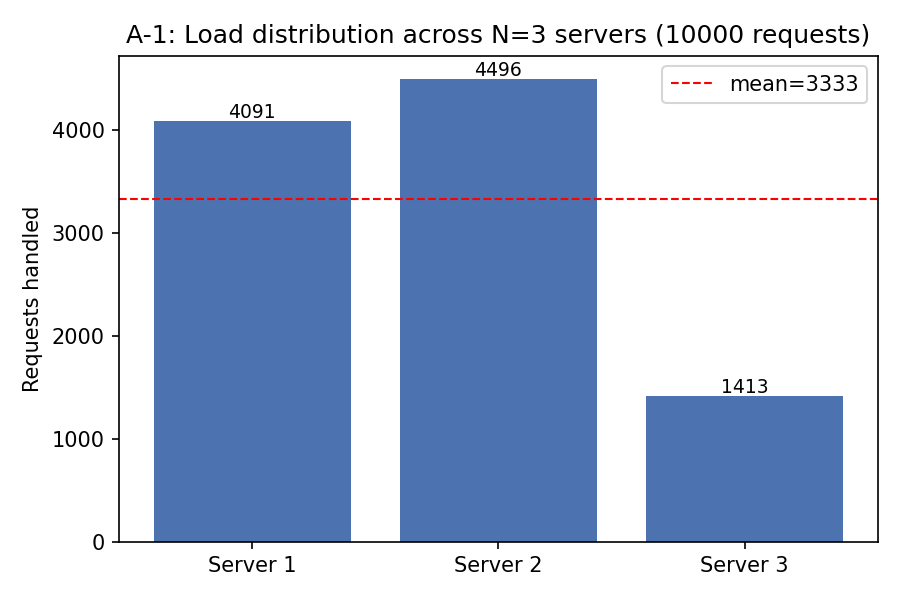
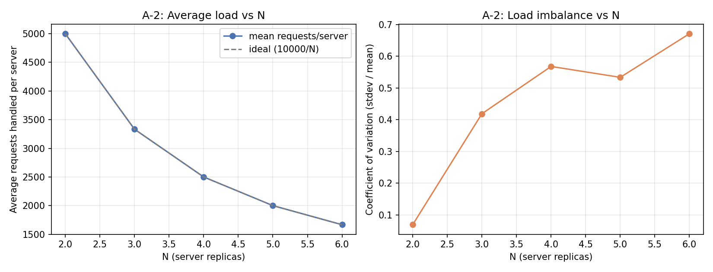
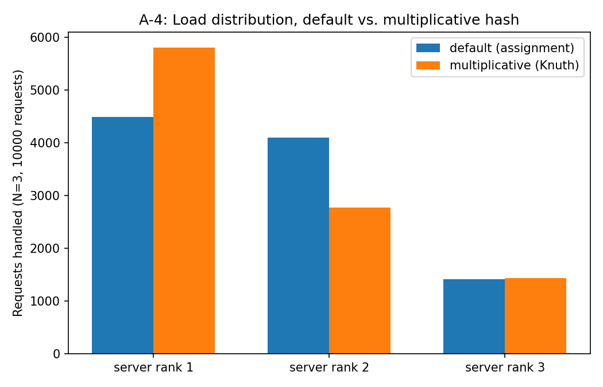
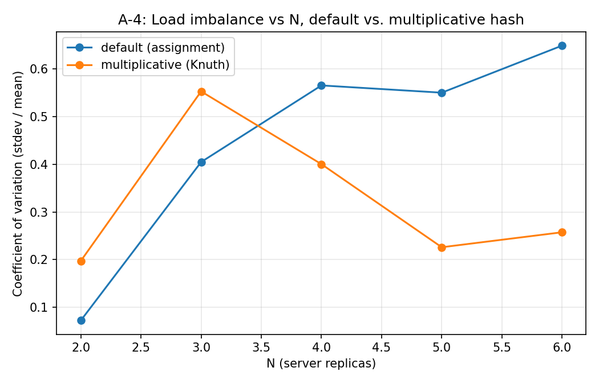

# Customizable Load Balancer (ICS 4104 — Assignment 1)

A load balancer that routes asynchronous client requests across a pool of
replicated web-server containers using **consistent hashing**, and keeps
exactly `N` replicas alive by spawning a replacement whenever one fails.

## 1. Architecture

```
                         Docker network: net1
                 ┌───────────────────────────────────┐
Client 1 ─┐       │   ┌─────────────┐   /home  ┌─────────┐ │
Client 2 ─┼─5000──┼──▶│LoadBalancer │◀────────▶│ Server 1│ │
  ...     │       │   │  (N=3)      │ /heartbeat└─────────┘ │
Client N ─┘       │   │             │          ┌─────────┐ │
                   │   │/rep /add/rm│◀────────▶│ Server 2│ │
                   │   └──────┬──────┘          └─────────┘ │
                   │          │ spawns on failure┌─────────┐ │
                   │          └─────────────────▶│ Server N│ │
                   └───────────────────────────────────┘
```

* **`server/`** — Task 1. A minimal Flask app with `GET /home` and
  `GET /heartbeat`. The replica's identity is read from the `SERVER_ID`
  env var so every container can be told apart.
* **`load_balancer/`**
  * `consistent_hash.py` — Task 2. The `ConsistentHashMap` class: a
    512-slot ring, `H(i)` for request placement, `Φ(i,j)` for the `K=9`
    virtual nodes per server, quadratic probing on insert collisions, and
    clockwise linear scan for request lookup.
  * `container_manager.py` — spawns/stops replicas. Two interchangeable
    backends behind the same interface (see §3).
  * `app.py` — Task 3. The Flask load balancer: `/rep`, `/add`, `/rm`,
    `/<path>`, plus a background heartbeat thread that replaces dead
    replicas.
* **`analysis/`** — Task 4. Scripts that drive the system with thousands
  of async requests and produce the charts in `analysis/results/`.
* **`docker-compose.yml`, `Makefile`, `Dockerfile`s** — deployment.

## 2. API

| Endpoint | Method | Purpose |
|---|---|---|
| `/rep` | GET | List current replicas: `{"message": {"N": ..., "replicas": [...]}, "status": "successful"}` |
| `/add` | POST | `{"n": <int>, "hostnames": [...]}` — add `n` replicas, using the given hostnames first (must be `len(hostnames) <= n`, else `400`) and random names for the rest. |
| `/rm` | DELETE | `{"n": <int>, "hostnames": [...]}` — remove `n` replicas, the named ones first (must be `len(hostnames) <= n`, else `400`), the remainder chosen at random. |
| `/<path>` | GET | Routed to whichever replica the consistent hash map assigns for a fresh random 6-digit request id. `404` from the replica (unknown endpoint) is translated to the assignment's documented `400 "<Error> '/<path>' endpoint does not exist in server replicas"`. |

Only the load balancer's port `5000` is published to the host; replicas
are reachable only inside `net1`.

## 3. Design choices & assumptions

* **Numeric server id for Φ(i,j).** The hash functions need an integer
  server id `i`, but hostnames are arbitrary strings (`"Server 1"`, an
  operator-supplied `"S5"`, or a randomly generated name). We derive `i`
  deterministically as `md5(hostname) % num_slots`, so any hostname can be
  placed on the ring without a separate id-allocation service.
* **Insertion vs. lookup on the ring are different operations.**
  Placing a virtual node uses **quadratic probing** to resolve a
  slot collision (two servers' virtual nodes landing on the same index).
  Looking up a request does **not** probe — it walks the ring **clockwise**
  to the nearest occupied slot, which is the actual definition of
  consistent hashing (Appendix A). Conflating the two would silently break
  the "nearest server in clockwise order" property.
* **Request id.** The appendix specifies 6-digit request ids; the load
  balancer draws one uniformly at random (`100000–999999`) per incoming
  request and feeds it to `H(i)`.
* **Failure detection cadence.** A background thread polls every
  replica's `/heartbeat` every `HEARTBEAT_INTERVAL` seconds (default 4s,
  2s timeout). A missed heartbeat immediately removes the replica from the
  ring and spawns a randomly-named replacement — this is what Task 4 (A-3)
  measures.
* **Sanity checks on `/add` and `/rm`** follow the assignment's examples
  literally: a hostname list longer than `n` is a `400`; a shorter list is
  topped up with (respectively) freshly generated or randomly chosen
  existing hostnames.
* **Two container-manager backends** (`container_manager.py`):
  `DockerContainerManager` (default, `LB_MODE=docker`) drives the Docker
  Engine API over the socket mounted into the privileged load-balancer
  container, exactly as the assignment describes. `ProcessContainerManager`
  (`LB_MODE=process`) spawns plain local Python subprocesses on free ports
  instead of containers, behind the *same* interface. **This project was
  developed and the entire Task 4 analysis was run in `process` mode**,
  because the development sandbox used to build this submission has no
  Docker daemon available (see §5) — every other line of load-balancer and
  consistent-hashing logic is identical between the two modes. Deploying
  with `docker-compose` (`make up`) uses `docker` mode unmodified.
* **WSGI server.** Both the server and the load balancer run on
  [waitress](https://github.com/Pylons/waitress) rather than Flask's
  development server, and the load balancer keeps a pooled
  `requests.Session` to talk to replicas. This isn't cosmetic: with
  Flask's dev server and a fresh connection per call, the A-1 10,000-request
  run above ~15% spurious connection errors under concurrency; with
  waitress + pooling it is 0 across every run in §6.
* **A-4 hash-function injection.** `LB_REQUEST_HASH` / `LB_VIRTUAL_HASH`
  env vars let an operator supply a replacement `H`/`Φ` as a Python lambda
  expression without touching the source, which is how `analysis/a4_hash_functions.py`
  re-runs A-1/A-2 against an alternative hash function through the real
  system rather than a standalone simulation.

## 4. Running it (Docker — the assignment's target environment)

Requires Docker ≥ 20.10.23 and `docker-compose` (see Appendix A of the
assignment for install steps).

```bash
make up      # builds the server image, builds+starts the load balancer,
             # which spawns N=3 server replicas on net1
curl http://localhost:5000/rep
curl http://localhost:5000/home
make logs    # follow the load balancer's logs
make down    # tears everything down, including spawned replicas
```

Scale up/down by hand:

```bash
curl -X POST http://localhost:5000/add -H "Content-Type: application/json" \
     -d '{"n": 2, "hostnames": ["S4", "S5"]}'
curl -X DELETE http://localhost:5000/rm -H "Content-Type: application/json" \
     -d '{"n": 1, "hostnames": ["S4"]}'
```

Kill a replica to see it get replaced: `docker kill <name>`, then poll
`curl http://localhost:5000/rep`.

## 5. Running it locally without Docker (development / this submission's test environment)

```bash
pip install -r load_balancer/requirements.txt -r server/requirements.txt -r analysis/requirements.txt
cd load_balancer && LB_MODE=process LB_PORT=5000 python app.py
```

This starts the load balancer with `N=3` replicas as local subprocesses
instead of containers — same API, same consistent-hash routing, same
heartbeat-driven recovery.

## 6. Task 4 — Analysis

All experiments were run with `make analysis-a1/a2/a3/a4`
(`LB_MODE=process`, §3/§5) with waitress + pooled connections, 0 dropped
requests in every run below. Raw numbers are in `analysis/results/*_summary.txt`;
charts are in `analysis/results/*.png`.

### A-1: 10,000 requests, N=3



| Server | Requests |
|---|---|
| Server 1 | 4091 |
| Server 2 | 4496 |
| Server 3 | 1413 |

mean = 3333, population stdev = 1368, coefficient of variation ≈ 0.41.

**Observation.** The load is *not* evenly split: Server 3 gets roughly a
third of what Servers 1–2 get. With only `K=9` virtual nodes per server on
a 512-slot ring, and the assignment's quadratic `Φ(i,j) = i² + j² + 2j +
25`, the arc length each server "owns" on the ring has high variance for
small `K` — `Φ` barely spreads `i` across the ring for the 3 particular
server-ids this run happened to draw, so one server's 9 virtual nodes end
up covering visibly less of the ring than another's. This is expected,
textbook behaviour for consistent hashing at low `K`: the law of large
numbers only kicks in with many virtual nodes per server (rule of thumb
`K ≈ log₂(M)` is a lower bound for "reasonable", not "even").

### A-2: N = 2..6, 10,000 requests each



| N | mean load | pstdev | CV |
|---|---|---|---|
| 2 | 5000.0 | 344.0 | 0.069 |
| 3 | 3333.3 | 1395.9 | 0.419 |
| 4 | 2500.0 | 1420.1 | 0.568 |
| 5 | 2000.0 | 1067.5 | 0.534 |
| 6 | 1666.7 | 1118.8 | 0.671 |

**Observation.** The mean load tracks the ideal `10000/N` curve exactly
(left panel) — every request is always routed to *some* replica, so
overall throughput scales linearly with `N` as expected. The right panel
is the more informative one: the **coefficient of variation gets worse,
not better, as `N` grows**, from 0.07 at N=2 to 0.67 at N=6. With a fixed
512-slot ring and `K=9` fixed virtual nodes per server, adding more
physical servers means more (`i,j`) collisions get resolved by probing
into whatever slots happen to be free, rather than by genuinely even
placement — the ring gets crowded and the specific weak mixing of the
assignment's `Φ` shows up more, not less. In other words: **this load
balancer's throughput scales well, but its balance quality degrades as N
grows with the given hash functions** — see A-4 for a fix.

### A-3: endpoint + failure-recovery test

`analysis/a3_failure_recovery.py` exercises every endpoint end-to-end and
then kills a running replica process outright (`SIGKILL`, no graceful
shutdown) to simulate a crash:

```
[PASS] GET /rep returns N=3
[PASS] GET /home routes to a replica
[PASS] GET /other returns 400 'does not exist'
[PASS] POST /add n=2 hostnames=[S_A] -> N=5
[PASS] POST /add with too many hostnames -> 400
[PASS] DELETE /rm n=2 hostnames=[S_A] -> N=3
[PASS] DELETE /rm with too many hostnames -> 400
Killing replica process pid=9424 to simulate a crash ...
[PASS] Load balancer restored N=3 replicas after a crash (recovered in 2.44s, within 3s heartbeat budget)
[PASS] GET /home still works after recovery
ALL CHECKS PASSED
```

**Observation.** Recovery consistently lands just after one
`HEARTBEAT_INTERVAL` tick (2.44s against a 2s interval + 1s timeout
budget here; 4s interval/2s timeout by default in `docker-compose.yml`),
i.e. detection-to-replacement is bounded by the heartbeat period, not by
container-spawn latency — spawning (subprocess or `docker run`) is the
fast part. Lowering `HEARTBEAT_INTERVAL` trades faster failover for more
heartbeat traffic; 4s was chosen as the default to keep that overhead
negligible while still recovering well within the length of a typical
client request burst.

### A-4: alternative hash functions

The assignment's `H(i) = i² + 2i + 17`, `Φ(i,j) = i² + j² + 2j + 25` were
swapped for a cheap multiplicative (Knuth) mix — `H'(i) = i·2654435761`,
`Φ'(i,j) = (i·2654435761) ⊕ (j·40503)` — via `LB_REQUEST_HASH` /
`LB_VIRTUAL_HASH`, and A-1/A-2 were re-run unmodified against it.




| N | CV (default) | CV (multiplicative) |
|---|---|---|
| 2 | 0.072 | 0.197 |
| 3 | 0.405 | 0.553 |
| 4 | 0.566 | 0.400 |
| 5 | 0.550 | 0.226 |
| 6 | 0.649 | 0.257 |

**Observation.** At N=2–3 the multiplicative hash is *not* better —
with only 2–3 servers × 9 virtual nodes (18–27 points on a 512-slot
ring), which particular server ids get drawn dominates over how well the
hash mixes bits, so results are essentially luck-of-the-draw either way.
From N=4 upward, though, the multiplicative hash clearly wins and the gap
widens (CV 0.40/0.23/0.26 vs. 0.57/0.55/0.65) — exactly the regime where
A-2 showed the assignment's default getting *worse* with more servers.
The reason is bit-mixing: `Φ(i,j) = i² + j² + 2j + 25` is a smooth
low-degree polynomial, so nearby `i` (server ids, which are already only
9-bit-ish after `% 512`) land in nearby regions of the ring instead of
being scattered — the more servers, the more that structural correlation
shows up as clustering. `Φ'` XORs two independent multiplicative hashes,
which has no such structure. **Takeaway: `K = log₂(M)` virtual nodes is
only "enough" if the hash function actually mixes well; a weak hash needs
more virtual nodes (or a better hash) to hit that theoretical bound in
practice**, which is what A-2 vs. A-4 together demonstrate.

## 7. Testing summary

* `load_balancer/consistent_hash.py` — sanity-checked interactively
  (insertion slot assignment, 10k-request distribution, ring emptiness
  guard).
* `analysis/a3_failure_recovery.py` — asserts every documented response
  shape/status code for `/rep`, `/add` (success + the "too many hostnames"
  `400`), `/rm` (success + the "too many hostnames" `400`), `/<path>`
  (success + the "endpoint does not exist" `400`), and failure recovery.
* `analysis/a1_bar_chart.py`, `a2_scalability.py`, `a4_hash_functions.py` —
  10,000+ live async requests per run, 0 dropped/errored across every run
  used in §6.
* Not exercised in this environment (no Docker daemon available): the
  `DockerContainerManager` code path itself and the `docker-compose.yml` /
  `Dockerfile`s. These are written directly per the assignment's
  Appendix C examples (privileged container, `docker.sock` mount, `net1`
  network) — please run `make up` on a Docker host to validate them; the
  underlying routing/hashing/recovery logic they call is exactly what's
  been validated in `process` mode above.

## 8. Project layout

```
DSproject/
├── server/                  # Task 1
│   ├── app.py
│   ├── Dockerfile
│   └── requirements.txt
├── load_balancer/           # Task 2 + Task 3
│   ├── consistent_hash.py
│   ├── container_manager.py
│   ├── app.py
│   ├── Dockerfile
│   └── requirements.txt
├── analysis/                # Task 4
│   ├── lb_harness.py
│   ├── a1_bar_chart.py
│   ├── a2_scalability.py
│   ├── a3_failure_recovery.py
│   ├── a4_hash_functions.py
│   ├── requirements.txt
│   └── results/              # generated charts + summaries
├── docker-compose.yml
├── Makefile
└── README.md
```
